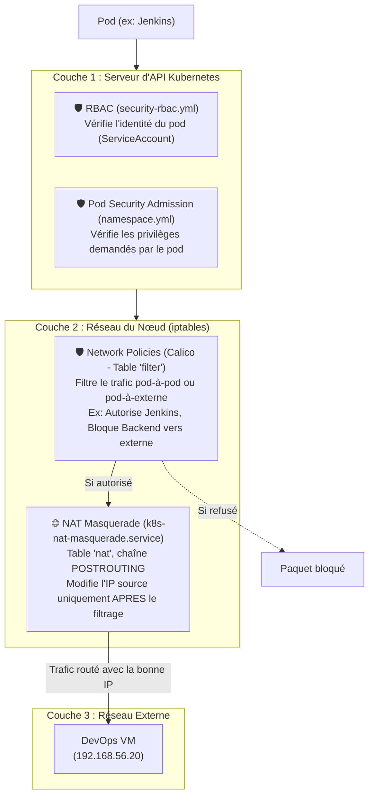

# Compatibilité : Sécurité Kubernetes et Routage NAT Masquerade

Ce document illustre pourquoi les solutions de sécurité légères déployées sur notre cluster Kubernetes (RBAC, Pod Security Admission, et Network Policies) fonctionnent en parfaite harmonie avec notre correctif de routage personnalisé (NAT Masquerade pour l'IP `192.168.56.20`).

## 🏗️ Architecture du Trafic et Sécurité

Le diagramme ci-dessous explique les différentes couches par lesquelles passe une requête réseau, démontrant que nos mesures de sécurité et de routage n'entrent jamais en conflit.

### 1. Pourquoi le RBAC et le PSA n'impactent pas le réseau
Le **RBAC** et le **Pod Security Admission (PSA)** sont des contrôles purement logiciels effectués par le serveur d'API de Kubernetes *avant même* que le pod ne soit autorisé à démarrer. Ils ne créent aucune règle firewall et ne touchent pas aux adresses IP. Ils n'ont donc aucune influence sur le fait que Jenkins puisse atteindre Gitea.

### 2. Pourquoi les Network Policies n'impactent pas le NAT
C'est ici que réside la force de notre conception :
1. **Séparation des tables Linux :** Les Network Policies générées par Calico opèrent dans la table `filter` d'iptables (qui décide si un paquet a le droit de passer). Notre service `k8s-nat-masquerade.service` opère dans la table `nat` (qui décide de l'apparence de l'adresse IP). Sous Linux, le filtrage de sécurité a toujours lieu *avant* le NAT de sortie (POSTROUTING).
2. **Ciblage par Namespace :** Nos Network Policies restrictives (Default Deny) ont été appliquées **uniquement au namespace `fullstack`**. Ainsi :
   - Les pods de l'application (Frontend, Backend) sont confinés et isolés.
   - Le pod **Jenkins** (situé dans le namespace `jenkins`) n'est soumis à aucune de ces restrictions. Il peut librement envoyer son trafic, qui passera ensuite par notre NAT Masquerade pour atteindre `192.168.56.20`.

## ✅ Conclusion
L'infrastructure bénéficie d'une sécurité maximale (moindre privilège, isolement réseau) sans aucun coût de ressources CPU/RAM supplémentaire, et maintient une connectivité parfaite avec la machine DevOps externe grâce à la stricte séparation des responsabilités entre Calico (`filter`) et nos règles de routage hôte (`nat`).
